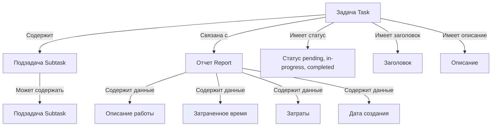

# 🤖 BrotherBot

**BrotherBot** — это современное веб-приложение для управления задачами с интеграцией Telegram и real-time коммуникацией, построенное на архитектуре микросервисов.

## 🎯 Основные возможности

- **📋 Управление задачами**: Создание, редактирование, удаление задач с поддержкой иерархии подзадач
- **📊 Отчетность**: Детальные отчеты по задачам с учетом времени и затрат  
- **📅 Календарь**: Визуализация задач в календарном представлении с диаграммами
- **💬 Real-time чат**: Мгновенный обмен сообщениями между пользователями
- **🔐 Telegram авторизация**: Безопасная аутентификация через Telegram
- **📱 PWA**: Поддержка Progressive Web App для мобильных устройств
- **🎨 Адаптивный дизайн**: Современный UI с поддержкой мобильных устройств

## 🏗️ Архитектура проекта

### Компоненты системы

```
┌─────────────────┐    ┌─────────────────┐    ┌─────────────────┐
│   Frontend      │    │  Socket Server  │    │    ArangoDB     │
│   (React/TS)    │◄──►│   (Node.js)     │◄──►│   (Database)    │
│   Port: 3001    │    │   Port: 3000    │    │   Port: 8529    │
└─────────────────┘    └─────────────────┘    └─────────────────┘
         │                       │                       │
         │              ┌─────────────────┐              │
         └──────────────►│  Facade App     │◄─────────────┘
                        │  (GraphQL API)  │
                        └─────────────────┘
```

### Структура проекта

- **`frontend/`** — React приложение с TypeScript
- **`socket_server/`** — Node.js сервер с Socket.io
- **`db/`** — Конфигурация ArangoDB
- **`facade-app/`** — GraphQL API сервис (в разработке)
- **`mediator-messenger/`** — Сервис-посредник для мессенджера

## 🚀 Быстрый старт

### Предварительные требования

- Node.js 16+ 
- Docker и Docker Compose
- Yarn или npm

### Установка и запуск

1. **Клонируйте репозиторий**
```bash
git clone <repository-url>
cd brotherbot
```

2. **Запуск через Docker (рекомендуется)**
```bash
# Полный запуск всех сервисов
docker-compose up -d

# Фронтенд будет доступен на http://localhost:3001
# Backend API на https://localhost:3000
```

3. **Запуск для разработки**

Backend:
```bash
cd socket_server
npm install
npm start
```

Frontend:
```bash
cd frontend
npm install
npm start
```

### Конфигурация SSL (для продакшена)

Для работы с HTTPS необходимо настроить SSL сертификаты:
```bash
# Обновите пути к сертификатам в socket_server/index.js
const httpsOptions = {
    key: fs.readFileSync('/path/to/your/privkey.pem'),
    cert: fs.readFileSync('/path/to/your/fullchain.pem'),
    ca: fs.readFileSync('/path/to/your/chain.pem')
};
```

## 🛠️ Технологический стек

### Frontend
- **React 18** с TypeScript
- **VK UI Kit** — компоненты интерфейса
- **Ant Design** — дополнительные UI компоненты  
- **Socket.io Client** — real-time коммуникация
- **ECharts** — диаграммы и графики
- **React Router** — маршрутизация
- **Service Workers** — PWA функциональность

### Backend
- **Node.js** — серверная платформа
- **Socket.io** — WebSocket соединения
- **ArangoDB** — граф-база данных
- **@socket.io/sticky** — кластеризация
- **@telegram-auth/server** — Telegram аутентификация

### База данных
- **ArangoDB** — NoSQL граф-база данных
- Коллекции: users, tasks, reports, messages, sessions

## 📡 Socket.io API События

### Аутентификация
- `session` — получение данных сессии
- `authentication_error` — ошибка аутентификации

### Пользователи  
- `users` — список всех пользователей
- `user connected` — подключение пользователя
- `user disconnected` — отключение пользователя

### Сообщения
- `private message` — отправка/получение приватного сообщения

### Задачи
- `tasks_limit_offset` — получение списка задач с пагинацией
- `new task` / `create_task` — создание новой задачи
- `update_task` — обновление задачи
- `delete_task` — удаление задачи
- `task_created` / `task_updated` / `task_deleted` — подтверждения операций

### Подзадачи
- `create_subtask` — создание подзадачи
- `subtask_created` — подтверждение создания

### Отчеты
- `add_report` — добавление отчета к задаче
- `update_report` — обновление отчета  
- `delete_report` — удаление отчета
- `report_added` / `report_updated` / `report_deleted` — подтверждения

### Детали задач
- `get_task_details` — получение подробной информации о задаче
- `task_details` — ответ с деталями задачи

## 📊 Модель данных



## 🔧 Разработка

### Полезные команды

```bash
# Проверка устаревших пакетов
npm outdated

# Обновление пакетов
npx npm-check-updates -u
npm install

# Временный SSL домен для разработки
ngrok http 3001
```

### Структура компонентов

**Frontend компоненты:**
- `MainPage` — главная страница с навигацией
- `BotList` — список задач с пагинацией
- `BotCalendarPage` — календарное представление
- `AuthPage` — страница авторизации
- `UserProfile` — профиль пользователя
- `SettingPage` — настройки

### Состояние разработки

- ✅ Базовая архитектура
- ✅ Аутентификация через Telegram
- ✅ CRUD операции для задач
- ✅ Real-time коммуникация
- ✅ Календарное представление
- 🚧 Компонент обновления задач (текущая ветка)
- 📋 GraphQL API (планируется)

## 🤝 Вклад в проект

1. Форкните репозиторий
2. Создайте ветку для функции (`git checkout -b feature/amazing-feature`)
3. Закоммитьте изменения (`git commit -m 'Add amazing feature'`)
4. Запушьте ветку (`git push origin feature/amazing-feature`)
5. Откройте Pull Request

## 📄 Лицензия

Этот проект распространяется под лицензией MIT.

---

## 📚 Документация

- **[📡 API документация](docs/API.md)** — полное описание Socket.io событий
- **[🚀 Руководство по установке](docs/SETUP.md)** — подробная инструкция по развертыванию
- **[🧩 Компоненты фронтенда](docs/COMPONENTS.md)** — архитектура React приложения

## 📚 Полезные ресурсы

- [PWA с React](https://create-react-app.dev/docs/making-a-progressive-web-app/)
- [Web App Manifest](https://developers.google.com/web/fundamentals/engage-and-retain/web-app-manifest/)
- [ECharts для React](https://echarts.apache.org/handbook/en/basics/import/)
- [Socket.io документация](https://socket.io/docs/)
- [ArangoDB документация](https://www.arangodb.com/docs/)