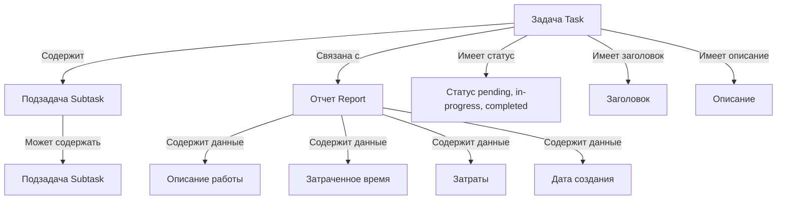

# brotherbot


### Общий запуск проекта
запуск бэкенда ([socket_server](socket_server))
```shell
    cd socket_server && docker-compose up -d
```

для разработки
```shell
    cd socket_server &&  npm start
```


Запуск фронтенда ([frontend](frontend))
```shell  
    cd frontend && npm start
```

### История разработки проекта

```shell  
    npm outdated // run to check outdated npm packages
```
```shell  
    npx npm-check-updates -u // run to check updates outdated npm packages
```
```shell 
    npm install // run to update npm packages
```

### Для получения временного  домена с SSL для разработки типа https://d344-192-109-241-26.ngrok-free.app/
```shell 
    ngrok http 3001
```
В процессе создания: 
https://create-react-app.dev/docs/making-a-progressive-web-app/

https://developers.google.com/web/fundamentals/engage-and-retain/web-app-manifest/

https://tuhub.ru/posts/progressive-web-app-with-react

https://web.dev/articles/add-manifest

https://ioflood.com/blog/python-socket/#:~:text=A%20Python%20socket%20is%20a,at%20localhost%20on%20port%2012345


Превращение приложения React в прогрессивное веб-приложение (PWA)
https://dev.to/ankitkamboj18/making-react-app-a-progressive-web-app-pwa-46dk

A day/week/monthly calendar component for React
https://github.com/nathanstitt/dayz

выбор даты
https://www.npmjs.com/package/react-mobile-datepicker-simple

хороший календарь
https://github.com/longlongago2/rm-calendar/tree/4cbf93698b34f1b980fa261b82104c84726b10b6

диаграма ганта
https://reactjsexample.com/interactive-gantt-chart-for-react-with-typescript/


